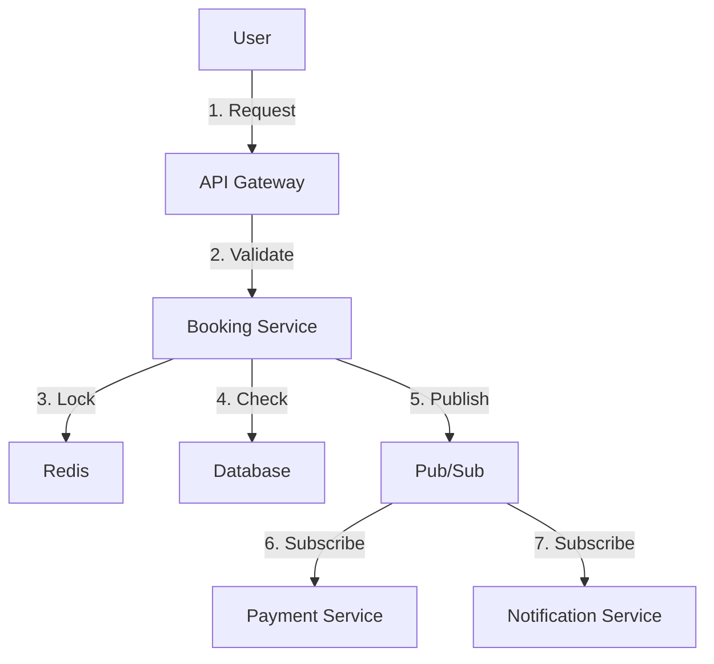

# System Architecture Diagrams

This document contains ASCII diagrams for the estaie platform architecture. For production use, these should be converted to proper diagrams using tools like Lucidchart, Draw.io, or Mermaid.

## High-Level System Architecture

```
┌─────────────────────────────────────────────────────────────────────────┐
│                         CLIENT LAYER (Global Users)                      │
│                    Mobile (Flutter) + Web (Next.js 15)                   │
└────────────────────────────────┬────────────────────────────────────────┘
                                 │
                                 ▼
┌─────────────────────────────────────────────────────────────────────────┐
│                    EDGE LAYER (Cloudflare + Vercel)                      │
│  ┌──────────────┐  ┌──────────────┐  ┌──────────────┐                  │
│  │ Cloudflare   │  │ Vercel Edge  │  │ Cloud CDN    │                  │
│  │ WAF + DDoS   │  │ Functions    │  │ (Static)     │                  │
│  └──────────────┘  └──────────────┘  └──────────────┘                  │
│  • Rate limiting    • Geo-routing     • Asset caching                   │
│  • Bot protection   • A/B testing     • Image optimization              │
│  • SSL termination  • Edge caching    • 100K sessions                   │
└────────────────────────────────┬────────────────────────────────────────┘
                                 │
                    ┌────────────┴────────────┐
                    │  Cloud Load Balancer    │
                    │  (Global Anycast IP)    │
                    └────────────┬────────────┘
                                 │
        ┌────────────────────────┼────────────────────────┐
        │                        │                        │
        ▼                        ▼                        ▼
┌───────────────┐       ┌───────────────┐       ┌───────────────┐
│  UAE Region   │       │  KSA Region   │       │   UK Region   │
│  (Primary)    │       │  (Secondary)  │       │  (Secondary)  │
└───────┬───────┘       └───────┬───────┘       └───────┬───────┘
        │                       │                        │
        └───────────────────────┼────────────────────────┘
                                │
                                ▼
┌─────────────────────────────────────────────────────────────────────────┐
│                      API GATEWAY LAYER (NestJS)                          │
│  ┌──────────────────────────────────────────────────────────────────┐  │
│  │  Cloud Run (Auto-scaling: 10 → 1000 instances)                   │  │
│  │  ┌────────────┐  ┌────────────┐  ┌────────────┐                 │  │
│  │  │ GraphQL    │  │ REST API   │  │ WebSocket  │                 │  │
│  │  │ Gateway    │  │ Gateway    │  │ Gateway    │                 │  │
│  │  └────────────┘  └────────────┘  └────────────┘                 │  │
│  │  • Authentication (JWT + OAuth2.0)                               │  │
│  │  • Authorization (RBAC + ABAC)                                   │  │
│  │  • Rate limiting (Redis Memorystore)                             │  │
│  │  • Request validation (Zod schemas)                              │  │
│  │  • Circuit breakers (Hystrix pattern)                            │  │
│  │  Target: 1K bookings/sec                                         │  │
│  └──────────────────────────────────────────────────────────────────┘  │
└─────────────────────────────────────────────────────────────────────────┘
```

## Booking Transaction Flow

```
┌─────────┐
│  User   │
└────┬────┘
     │ 1. Create booking request
     ▼
┌─────────────────┐
│  API Gateway    │
└────┬────────────┘
     │ 2. Validate & authenticate
     ▼
┌─────────────────┐
│ Booking Service │
└────┬────────────┘
     │ 3. Acquire Redis lock
     ├─────────────────────────────┐
     │                             │
     ▼                             ▼
┌──────────────┐           ┌──────────────┐
│ Check        │           │ Create       │
│ Inventory    │           │ Booking      │
│ (Read        │           │ (PENDING)    │
│ Replica)     │           │              │
└──────┬───────┘           └──────┬───────┘
       │                          │
       └──────────┬───────────────┘
                  │ 4. Publish booking.created
                  ▼
         ┌────────────────┐
         │    Pub/Sub     │
         └────┬───────────┘
              │
    ┌─────────┼─────────┐
    │         │         │
    ▼         ▼         ▼
┌─────────┐ ┌─────────┐ ┌─────────┐
│Inventory│ │Payment  │ │Partner  │
│Service  │ │Service  │ │Sync     │
└─────────┘ └─────────┘ └─────────┘
```

## Multi-Region Deployment Topology

```
┌──────────────────────────────────────────────────────────────┐
│                    Global Load Balancer                       │
│              (Geo-routing + Health Checks)                    │
└────────────┬─────────────────┬─────────────────┬─────────────┘
             │                 │                 │
             ▼                 ▼                 ▼
┌────────────────────┐ ┌────────────────┐ ┌────────────────┐
│   UAE Region       │ │  KSA Region    │ │  UK Region     │
│   (Primary)        │ │  (Secondary)   │ │  (Secondary)   │
├────────────────────┤ ├────────────────┤ ├────────────────┤
│ • Cloud Run (10+)  │ │ • Cloud Run    │ │ • Cloud Run    │
│ • PostgreSQL       │ │ • PostgreSQL   │ │ • PostgreSQL   │
│   (Primary)        │ │   (Replica)    │ │   (Replica)    │
│ • Redis (HA)       │ │ • Redis (HA)   │ │ • Redis (HA)   │
│ • Pub/Sub          │ │ • Pub/Sub      │ │ • Pub/Sub      │
└────────────────────┘ └────────────────┘ └────────────────┘
         │                    │                    │
         └────────────────────┴────────────────────┘
                              │
                    Cross-region replication
                    (Read replicas only)
```

## Data Flow: Booking with Payment

```
Time: 0s
┌──────────────────────────────────────────────────────────────┐
│ User clicks "Book Now"                                        │
└──────────────────────┬───────────────────────────────────────┘
                       │
Time: 0.1s             ▼
┌──────────────────────────────────────────────────────────────┐
│ API Gateway: Validate request, check auth                    │
└──────────────────────┬───────────────────────────────────────┘
                       │
Time: 0.2s             ▼
┌──────────────────────────────────────────────────────────────┐
│ Booking Service:                                              │
│ 1. Acquire Redis lock (5ms)                                  │
│ 2. Check inventory (30ms)                                    │
│ 3. Create booking PENDING_PAYMENT (50ms)                     │
│ 4. Publish booking.created (10ms)                            │
│ 5. Release lock (5ms)                                        │
└──────────────────────┬───────────────────────────────────────┘
                       │
Time: 0.3s             ▼
┌──────────────────────────────────────────────────────────────┐
│ Payment Service:                                              │
│ 1. Create Stripe payment intent (200ms)                      │
│ 2. Store payment record (50ms)                               │
│ 3. Return payment URL to user (10ms)                         │
└──────────────────────┬───────────────────────────────────────┘
                       │
Time: 0.6s             ▼
┌──────────────────────────────────────────────────────────────┐
│ User completes payment on Stripe                              │
└──────────────────────┬───────────────────────────────────────┘
                       │
Time: 5s               ▼
┌──────────────────────────────────────────────────────────────┐
│ Stripe webhook → Payment Service:                            │
│ 1. Verify signature (10ms)                                   │
│ 2. Update payment COMPLETED (50ms)                           │
│ 3. Publish payment.completed (10ms)                          │
└──────────────────────┬───────────────────────────────────────┘
                       │
Time: 5.1s             ▼
┌──────────────────────────────────────────────────────────────┐
│ Booking Service:                                              │
│ 1. Update booking CONFIRMED (50ms)                           │
│ 2. Publish booking.confirmed (10ms)                          │
└──────────────────────┬───────────────────────────────────────┘
                       │
Time: 5.2s             ├─────────────┬─────────────┐
                       ▼             ▼             ▼
              ┌────────────┐ ┌────────────┐ ┌────────────┐
              │ Inventory  │ │ Partner    │ │Notification│
              │ Service    │ │ Sync       │ │ Service    │
              │            │ │            │ │            │
              │ Convert to │ │ Sync with  │ │ Send email │
              │ hard       │ │ 50+        │ │ WhatsApp   │
              │ reservation│ │ partners   │ │ Push       │
              └────────────┘ └────────────┘ └────────────┘
```

## Circuit Breaker Pattern

```
┌─────────────────────────────────────────────────────────────┐
│                    Circuit Breaker States                    │
└─────────────────────────────────────────────────────────────┘

    ┌─────────────┐
    │   CLOSED    │  (Normal operation)
    │  (Working)  │
    └──────┬──────┘
           │
           │ Failure rate > 50%
           │ (in 10s window)
           ▼
    ┌─────────────┐
    │    OPEN     │  (Failing)
    │  (Blocked)  │  • Reject all requests
    └──────┬──────┘  • Return fallback
           │         • Wait 30s
           │
           │ After 30s timeout
           ▼
    ┌─────────────┐
    │ HALF_OPEN   │  (Testing)
    │  (Testing)  │  • Allow 1 request
    └──────┬──────┘  • Test if recovered
           │
           ├─────────────────┬─────────────────┐
           │                 │                 │
    Success│          Failure│                 │
           ▼                 ▼                 │
    ┌─────────────┐   ┌─────────────┐        │
    │   CLOSED    │   │    OPEN     │        │
    │  (Working)  │   │  (Blocked)  │────────┘
    └─────────────┘   └─────────────┘
```

## Observability Stack

```
┌─────────────────────────────────────────────────────────────┐
│                    Application Layer                         │
│  • Cloud Run services                                        │
│  • Next.js frontend                                          │
│  • Go microservices                                          │
└────────────────────┬────────────────────────────────────────┘
                     │
        ┌────────────┼────────────┐
        │            │            │
        ▼            ▼            ▼
┌──────────────┐ ┌──────────────┐ ┌──────────────┐
│   LOGGING    │ │   METRICS    │ │   TRACING    │
│              │ │              │ │              │
│ Cloud        │ │ Cloud        │ │ Cloud        │
│ Logging      │ │ Monitoring   │ │ Trace        │
│              │ │              │ │              │
│ + Sentry     │ │ + Prometheus │ │ + Jaeger     │
└──────┬───────┘ └──────┬───────┘ └──────┬───────┘
       │                │                │
       └────────────────┼────────────────┘
                        │
                        ▼
        ┌───────────────────────────────┐
        │   Visualization & Alerting    │
        │                               │
        │  • Grafana dashboards         │
        │  • Cloud Monitoring alerts    │
        │  • Slack notifications         │
        │  • PagerDuty incidents        │
        └───────────────────────────────┘
```

## Security Layers

```
┌─────────────────────────────────────────────────────────────┐
│ Layer 7: Application Security                               │
│ • Input validation (Zod)                                    │
│ • Authentication (JWT)                                      │
│ • Authorization (RBAC)                                      │
│ • Rate limiting (per user)                                  │
└────────────────────┬────────────────────────────────────────┘
                     │
┌─────────────────────────────────────────────────────────────┐
│ Layer 6: API Gateway                                        │
│ • Request validation                                        │
│ • Circuit breakers                                          │
│ • Timeout enforcement                                       │
└────────────────────┬────────────────────────────────────────┘
                     │
┌─────────────────────────────────────────────────────────────┐
│ Layer 5: Cloud Armor                                        │
│ • DDoS protection                                           │
│ • OWASP Top 10 rules                                        │
│ • Geo-blocking                                              │
└────────────────────┬────────────────────────────────────────┘
                     │
┌─────────────────────────────────────────────────────────────┐
│ Layer 4: Cloudflare WAF                                     │
│ • Bot detection                                             │
│ • Rate limiting (per IP)                                    │
│ • SSL/TLS termination                                       │
└────────────────────┬────────────────────────────────────────┘
                     │
┌─────────────────────────────────────────────────────────────┐
│ Layer 3: Network Security                                   │
│ • VPC isolation                                             │
│ • Private IPs for databases                                 │
│ • Firewall rules                                            │
└────────────────────┬────────────────────────────────────────┘
                     │
┌─────────────────────────────────────────────────────────────┐
│ Layer 2: Data Security                                      │
│ • Encryption at rest                                        │
│ • Encryption in transit                                     │
│ • Secrets in Secret Manager                                 │
└────────────────────┬────────────────────────────────────────┘
                     │
┌─────────────────────────────────────────────────────────────┐
│ Layer 1: Infrastructure Security                            │
│ • IAM least privilege                                       │
│ • Service accounts                                          │
│ • Audit logging                                             │
└─────────────────────────────────────────────────────────────┘
```

---

## Converting to Production Diagrams

These ASCII diagrams should be converted to proper diagrams using:

1. **Lucidchart** - Professional diagrams for presentations
2. **Draw.io** - Free, open-source diagramming tool
3. **Mermaid** - Markdown-based diagrams (can be embedded in docs)
4. **PlantUML** - Text-based UML diagrams
5. **Excalidraw** - Hand-drawn style diagrams

### Example Mermaid Diagram



---

**Last Updated:** 2025-12-01

